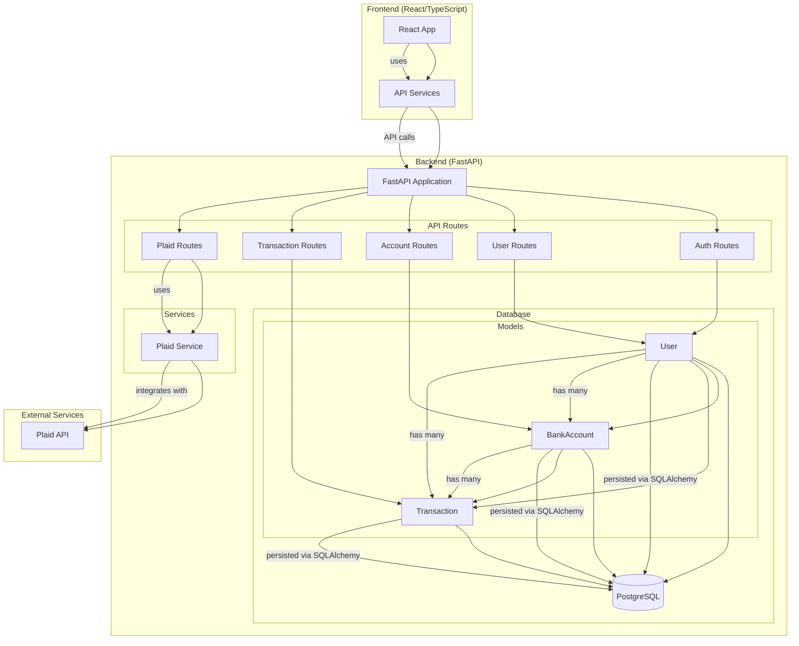

# My-Dinero Backend Architecture Diagram

```mermaid
graph TD
    %% Frontend
    subgraph Frontend["Frontend (React/TypeScript)"]
        ReactApp["React App"]
        FrontendServices["API Services"]
    end

    %% Backend
    subgraph Backend["Backend (FastAPI)"]
        FastAPI["FastAPI Application"]

        subgraph Routes["API Routes"]
            AuthRoutes["Auth Routes"]
            UserRoutes["User Routes"]
            AccountRoutes["Account Routes"]
            TransactionRoutes["Transaction Routes"]
            PlaidRoutes["Plaid Routes"]
        end

        subgraph Services["Services"]
            PlaidService["Plaid Service"]
        end

        subgraph Database["Database"]
            DB[(PostgreSQL)]

            subgraph Models["Models"]
                UserModel["User"]
                AccountModel["BankAccount"]
                TransactionModel["Transaction"]
            end
        end
    end

    %% External Services
    subgraph External["External Services"]
        PlaidAPI["Plaid API"]
    end

    %% Frontend connections
    ReactApp --> FrontendServices
    FrontendServices --> FastAPI

    %% Backend route connections
    FastAPI --> AuthRoutes
    FastAPI --> UserRoutes
    FastAPI --> AccountRoutes
    FastAPI --> TransactionRoutes
    FastAPI --> PlaidRoutes

    %% Service connections
    PlaidRoutes --> PlaidService
    PlaidService --> PlaidAPI

    %% Database connections
    AuthRoutes --> UserModel
    UserRoutes --> UserModel
    AccountRoutes --> AccountModel
    TransactionRoutes --> TransactionModel

    %% Database interactions
    UserModel --> DB
    AccountModel --> DB
    TransactionModel --> DB

    %% Model relationships
    UserModel --> AccountModel
    UserModel --> TransactionModel
    AccountModel --> TransactionModel

    %% Add labels
    ReactApp -- "uses" --> FrontendServices
    FrontendServices -- "API calls" --> FastAPI
    PlaidRoutes -- "uses" --> PlaidService
    PlaidService -- "integrates with" --> PlaidAPI
    UserModel -- "persisted via SQLAlchemy" --> DB
    AccountModel -- "persisted via SQLAlchemy" --> DB
    TransactionModel -- "persisted via SQLAlchemy" --> DB
    UserModel -- "has many" --> AccountModel
    UserModel -- "has many" --> TransactionModel
    AccountModel -- "has many" --> TransactionModel
```